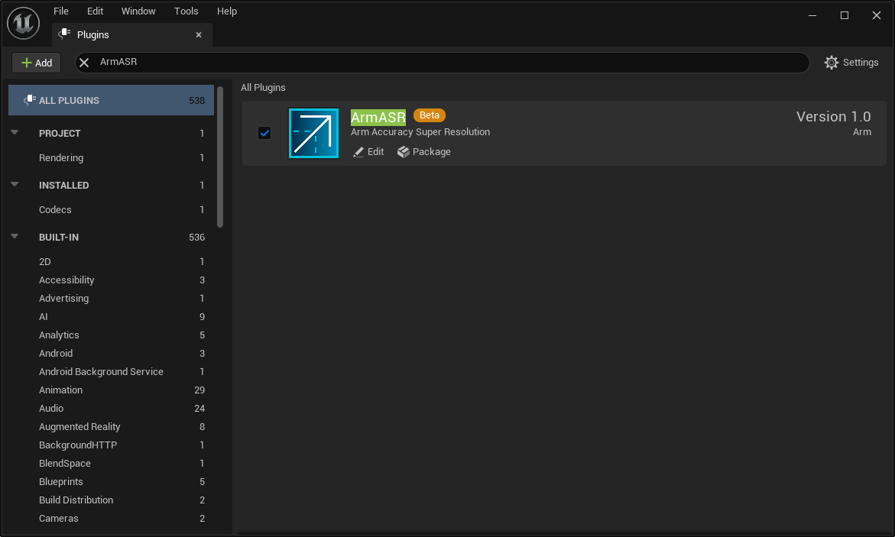
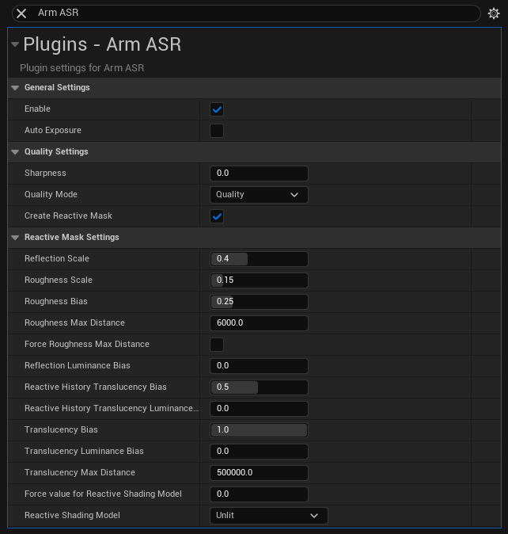

<!-- Copyright © 2024-2025 Arm Limited.
SPDX-License-Identifier: MIT -->


# Arm® Accuracy Super Resolution™ (Arm ASR) Unreal® Engine Plugin

## Table of contents

- [Introduction](#introduction)
- [Prerequisites](#prerequisites)
- [Installation](#installation)
- [Vulkan® SM5](#vulkan-sm5)
- [Usage](#usage)
- [Settings](#settings)
- [Configuration Parameters](#configuration-parameters)
- [License](#license)
- [Trademarks and Copyrights](#trademarks-and-copyrights)
- [Contact](#contact)
- [Security Issues](#security-issues)

## Introduction

**Arm® Accuracy Super Resolution™** is a mobile-optimized temporal upscaling technique derived from AMD's [FidelityFX™ Super Resolution 2 v2.2.2](https://github.com/GPUOpen-LibrariesAndSDKs/FidelityFX-SDK/blob/main/docs/techniques/super-resolution-temporal.md). Arm ASR includes multiple optimizations on top of the original **FidelityFX™ Super Resolution 2** to make the technique suited for the more resource-constrained environment of mobile gaming. The team would like to express their gratitude to AMD and the engineers behind the original technique for their work and releasing it publicly to the world.

Arm ASR uses temporal accumulation to reconstruct high-resolution images while maintaining fine geometric and texture details compared to native rendering. It can enable "practical performance" for costly render operations, such as hardware ray tracing.

This Unreal® Engine plugin provides an implementation of the Arm ASR upscaler to be used with Unreal® projects. It implements the `UE::Renderer::Private::ITemporalUpscaler` interface provided by the engine and it can be integrated effortlessly into your game.

## Prerequisites

The plugin was developed primarily with games that run on Android™ in mind and was tested on 64-bit Windows® and Android™ with the following setup:

- Unreal® Engine, versions:
  - 5.5
  - 5.4
  - 5.3
- Mobile Renderer
  - OpenGL® ES 3.2
  - Vulkan®
- Desktop Renderer
  - Vulkan®


The plugin has limited support for OpenGL® for Embedded Systems 3.2 (GLES), although Vulkan® support remains a main focus.
The plugin might work fine with other versions of Unreal® Engine and other RHIs as well &ndash; such as DirectX® on Windows® &ndash; but we must caution that any configuration other than the one above should be treated as untested & officially unsupported.

## Installation

This installation guide assumes that you have an Unreal® C++ project you intend to use this plugin with &ndash; if not, create one as a first step. We also assume that you have downloaded and &ndash; if needed &ndash; unzipped the plugin code. If you are reading this document online, download the latest plugin source code to your machine, then:

1. Create a `Plugins` folder in your project root folder (if one doesn't exist already).
2. Copy the `ArmASR` plugin folder (the parent folder of this `README.md` file) into your project's `Plugins` folder.
3. Re-generate Visual Studio® project files and recompile your project.
4. Start your project in Unreal® Editor and check that the `ArmASR` plugin is enabled. If not, enable it.



For engine-wide installation copy the plugin folder into `Engine\Plugins` within the Unreal® Engine root folder. For further information about plugins in Unreal® Engine please refer to the [official Unreal® Engine website](https://dev.epicgames.com/documentation/en-us/unreal-engine/plugins-in-unreal-engine).

For general instructions about building and deploying on Android, please refer to the following official Unreal® Engine guides:
* [Setting Up Android SDK and NDK](https://dev.epicgames.com/documentation/en-us/unreal-engine/how-to-set-up-android-sdk-and-ndk-for-your-unreal-engine-development-environment?application_version=5.3)
* [Android Quick Start](https://dev.epicgames.com/documentation/en-us/unreal-engine/setting-up-unreal-engine-projects-for-android-development)

Please proceed to the next section for further instructions relating to configuring your project.

## Mobile Renderer
If using the mobile renderer with Arm ASR the following fix in Unreal needs to be applied:

https://github.com/EpicGames/UnrealEngine/commit/35ea9179968049dd607668eb0c272f3b7370b2a4

### OpenGL® ES 3.2

The plugin provides limited support for GLES version 3.2 on Android in case the targeted device does not support Vulkan®.
1. To enable GLES support for your Android application alongside Vulkan® make sure that the following is set in your `Config\DefaultEngine.ini` file:
```
[/Script/AndroidRuntimeSettings.AndroidRuntimeSettings]
bSupportsVulkan=True
bBuildForES31=True
```
2. Allow OpenGL® to use deferred shader rendering:
```
[/Script/Engine.RendererSettings]
r.Mobile.AllowDeferredShadingOpenGL=True
```

Note that Unreal® Engine does not support deferred rendering in OpenGL® mobile preview. When running in OpenGL® mobile preview the plugin will not use reactive mask and, as such, is not a representation how the project will run on a real device. On the actual Andoid device reactive mask will be used.

## Desktop Renderer (Vulkan® SM5)

As mentioned above, we mainly test and support the plugin with the Desktop Renderer (Vulkan® SM5). In order to make sure the rendering settings of your project match this, the following needs to be done:

### Android

The Deskop Renderer (Vulkan® SM5) is an experimental feature on Android, which is disabled by default and needs to be enabled explicitly, as follows:

1. Add the following control variables under the `[/Script/AndroidRuntimeSettings.AndroidRuntimeSettings]` of your project's `Config\DefaultEngine.ini` file.

```
bSupportsVulkan=True
bSupportsVulkanSM5=True
```

2. Make sure that the Desktop Renderer (Vulkan® SM5) support is enabled for the relevant devices in the project's device profile file by setting both `r.Android.DisableVulkanSupport` and `r.Android.DisableVulkanSM5Support` to 0, as in the following example `Config\Android\AndroidDeviceProfiles.ini` file:

```
[Android_Mali_G7xx_Vulkan DeviceProfile]
DeviceType=Android
BaseProfileName=Android
+CVars=r.Android.DisableVulkanSupport=0
+CVars=r.Android.DisableVulkanSM5Support=0
```

### Windows

Search for `DefaultGraphicsRHI` in the `[/Script/WindowsTargetPlatform.WindowsTargetSettings]` of `Config\DefaultEngine.ini` and ensure it is set as follows:

```
DefaultGraphicsRHI=DefaultGraphicsRHI_VULKAN
+VulkanTargetedShaderFormats=SF_VULKAN_SM5
```

For more details about changing the default RHI in UE, please read [this article](https://dev.epicgames.com/community/learning/tutorials/aqV9/render-hardware-interface-rhi).

## Usage

Once installed, the plugin will automatically handle the upscaling of all frames, as long as temporal upscaling is enabled on your project. In order to enable it, the folowing console variable needs to be set under `[/Script/Engine.RendererSettings]`:

```
r.AntiAlisingMethod=2
```

NOTE: Please note that, though there is a separate `r.Mobile.AntiAliasing` control variable as well, it is the one above that needs to be set for temporal upscaling to run on Vulkan® SM5.

Further configuration options are presented in the next section.

## Settings

The upscaling ratio of Arm ASR can be set via `r.ScreenPercentage`. For example, a value of `50.0` will mean that the plugin upscales frames by a factor of 2.

The command `ShowFlag.VisualizeTemporalUpscaler 1` can be used to display debug information related to Arm ASR, including, but not limited to, input and output resolution.

### Configuration Parameters

Arm ASR's behaviour can be further configured via plugin-specific console variables. These can be set either through the console or via the UI, accessible under `Project Settings > Plugins > Arm ASR`.



The following plugin-specific console variables can be set:

| Console Variable                                   | Default Value | Value Range | Details                                                                                                |
| :------------------------------------------------- | :------------ | :---------- | :----------------------------------------------------------------------------------------------------- |
| `r.ArmASR.Enable`                                  | 1             | 0, 1        | Enable / disable Arm ASR.                                                    |
| `r.ArmASR.AutoExposure`                            | 0             | 0, 1        | Set to 1 to use Arm ASR’s own auto-exposure, otherwise the engine’s auto-exposure value is used.       |
| `r.ArmASR.Sharpness`                               | 0             | 0-1         | If greater than 0 this enables Robust Contrast Adaptive Sharpening Filter to sharpen the output image. |
| `r.ArmASR.ShaderQuality`                           | 1             | 1, 2, 3     | Select shader quality preset: 1 - Quality, 2 - Balanced, 3 - Performance.                              |
| `r.ArmASR.CreateReactiveMask`                      | 1             | 0, 1        | Create the reactive mask.                                                                |
| `r.ArmASR.ReactiveMaskReflectionScale`             | 0.4           | 0-1         | Scales the Unreal engine reflection contribution to the reactive mask, which can be used to control the amount of aliasing on reflective surfaces. |
| `r.ArmASR.ReactiveMaskRoughnessScale`              | 0.15          | 0-1         | Scales the GBuffer roughness to provide a fallback value for the reactive mask when screenspace & planar reflections are disabled or don't affect a pixel. |
| `r.ArmASR.ReactiveMaskRoughnessBias`               | 0.25          | 0-1         | Biases the reactive mask value when screenspace/planar reflections are weak with the GBuffer roughness to account for reflection environment captures. |
| `r.ArmASR.ReactiveMaskRoughnessMaxDistance`        | 6000          | -           | Maximum distance in world units for using material roughness to contribute to the reactive mask, the maximum of this value and `View.FurthestReflectionCaptureDistance` will be used. |
| `r.ArmASR.ReactiveMaskRoughnessForceMaxDistance`   | 0             | -           | Enable to force the maximum distance in world units for using material roughness to contribute to the reactive mask rather than using `View.FurthestReflectionCaptureDistance`. |
| `r.ArmASR.ReactiveMaskReflectionLumaBias`          | 0             | 0-1         | Biases the reactive mask by the luminance of the reflection. Use it to balance aliasing against ghosting on brightly lit reflective surfaces. |
| `r.ArmASR.ReactiveHistoryTranslucencyBias`         | 0.5           | 0-1         | Scales how much translucency suppresses history via the reactive mask. Higher values will make translucent materials more reactive, which can reduce smearing. |
| `r.ArmASR.ReactiveHistoryTranslucencyLumaBias`     | 0             | 0-1         | Biases how much the translucency suppresses history via the reactive mask by the luminance of the transparency. Higher values will make bright translucent materials more reactive which can reduce smearing. |
| `r.ArmASR.ReactiveMaskTranslucencyBias`            | 1             | 0-1         | Scales how much contribution translucency makes to the reactive mask. Higher values will make translucent materials more reactive which can reduce smearing. |
| `r.ArmASR.ReactiveMaskTranslucencyLumaBias`        | 0             | 0-1         | Biases the translucency contribution to the reactive mask by the luminance of the transparency. Higher values will make bright translucent materials more reactive which can reduce smearing. |
| `r.ArmASR.ReactiveMaskTranslucencyMaxDistance`     | 500000        | -           | Maximum distance in world units for using translucency to contribute to the reactive mask. This is a way to remove sky-boxes and other back-planes from the reactive mask, at the expense of nearer translucency not being reactive. |
| `r.ArmASR.ReactiveMaskForceReactiveMaterialValue`  | 0             | 0-1         | Force the reactive mask value for Reactive Shading Model materials, when > 0 this value can be used to override the value supplied in the Material Graph. |
| `r.ArmASR.ReactiveMaskReactiveShadingModelID`      | MSM_NUM       | -           | Treat the specified shading model as reactive, taking the `CustomData0.x` value as the reactive value to write into the mask. |

### Screen Space Reflections
When utilizing screen space reflections, it can be beneficial to incorporate them into the reactive mask. To do this, ensure that `r.SSR.ExperimentalDenoiser` is set to `1`.

## License

Please see the [LICENSE file](./LICENSES/MIT.txt) for details.

## Trademarks and Copyrights

AMD is a trademark of Advanced Micro Devices, Inc.

AMD FidelityFX™ is a trademark of Advanced Micro Devices, Inc.

Android is a trademark of Google LLC.

Arm® is a registered trademark of Arm Limited (or its subsidiaries) in the US and/or elsewhere.

Unreal® is a trademark or registered trademark of Epic Games, Inc. in the United States of America and elsewhere.

Vulkan is a registered trademark and the Vulkan SC logo is a trademark of the Khronos Group Inc.

DirectX, Windows are registered trademarks or trademarks of Microsoft Corporation in the US and other jurisdictions.

OpenGL is a registered trademark and the OpenGL ES logo is a trademark of Hewlett Packard Enterprise used by permission by Khronos.

## Contact

You can reach out to us on the following email address: <arm-asr-support@arm.com>.

## Security Issues

Arm takes security isses seriously please see [Security](SECURITY.md) for more details.

